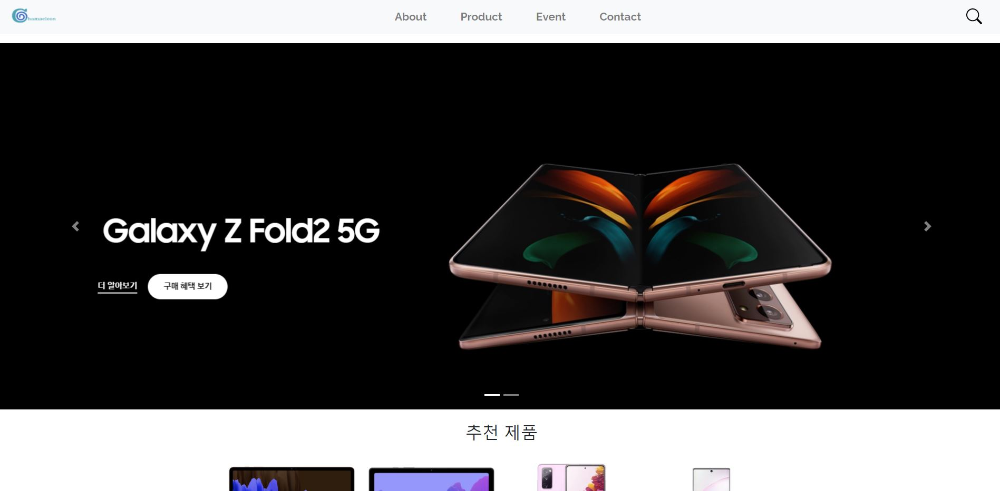

# Chameleon CMS - 제일기획 기업 연계 PJT


> 팀원 : 김유기(팀장), 강현영, 송은석, 임선빈, 장주환
>
> 개발기간 :  20.10.12 ~ 20.11.16





## 목차

- [개요](#개요)
- [주요기능](#주요기능)
- [ERD](#ERD)
- [와이어프레임](#와이어프레임)
- [기술스택](#기술스택)
- [초기설정](#초기설정)
- [로컬서버실행](#로컬서버실행)
- [RESTAPI문서](#RESTAPI문서)


## 배포주소

Customer Page : https://chameleon.gq/

Admin Page : https://chameleon.gq/admin


## 개요

언택트 시대를 맞아 오프라인에서 확인하던 제품을 온라인으로 간편하게 확인하길 원하는 고객의 Needs를 반영

운영 효율성을 높이기 위해 제품의 추가/수정이 용이하도록 CMS로 제어할 수 있는 온라인 제품 소개 사이트 플랫폼 제작


## 주요기능

- 제품 등록 전 미리보기
- 부서 추가 기능
- 활동로그 기능
- 제품 카테고리별 레이아웃 템플릿 제공
- 제품별 레이아웃 템플릿 제공
- 이벤트 추가 / 수정 / 임시저장
- 이벤트 노출 활성화 / 비활성화
- 제품 등록 / 수정 / 임시저장 
  - 저장 히스토리 제공을 통해 git과 같이 과거에 등록했던 내용을 가져오기 가능
  - 제품 노출 활성화 / 비활성화
- 회원가입 / 로그인
- 공지사항 팝업 
- 유저 권한에 따른 페이지 접근 제한 및 업무 제한
- 제품 및 이벤트 검색 기능


## ERD


## 와이어프레임

[와이어프레임 보러가기](./doc/와이어프레임.pdf)


## 기술스택

- Frontend
  - Vue.js 2.6.11
  - Node.js 12.18.2
  - npm 6.14.5
- Backend
  - django 2.1.15
  - python 3.7.7
- Infra
- OS
  - Ubuntu 18.04
- DB


## 초기설정

- node.js / vue-cli 설치
- frontend 라이브러리 설치

```
frontend /

npm install
```


## 로컬서버실행

- frontend

> frontend 폴더에서

```
npm run serve
```

- backend

> backend 폴더에서

```
python manage.py runserver
```


## RESTAPI문서

[RESTAPI 문서 보러가기](./doc/RESTAPI.md)