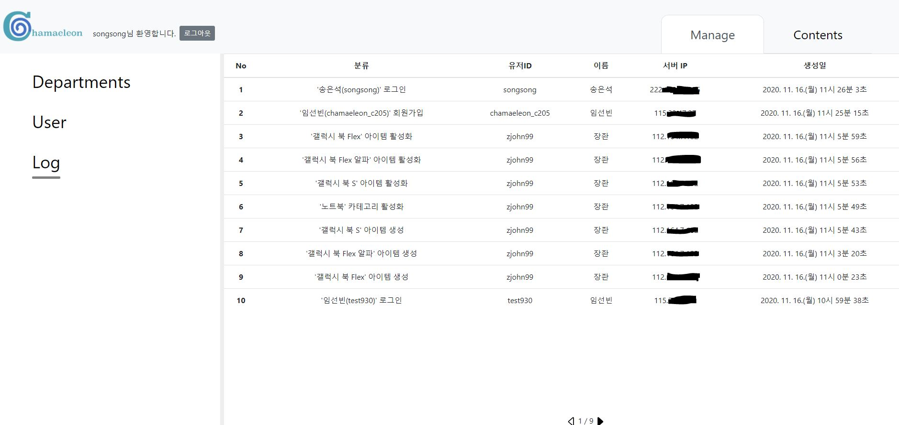
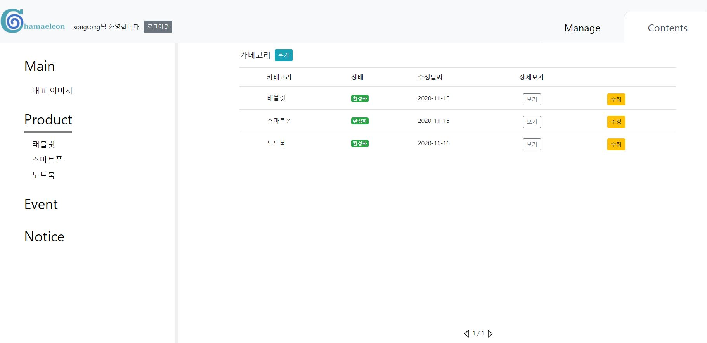
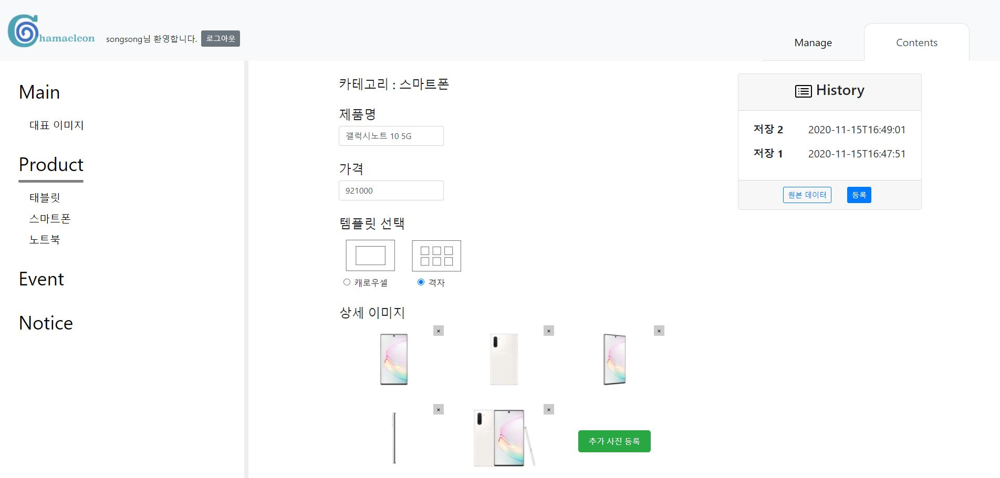
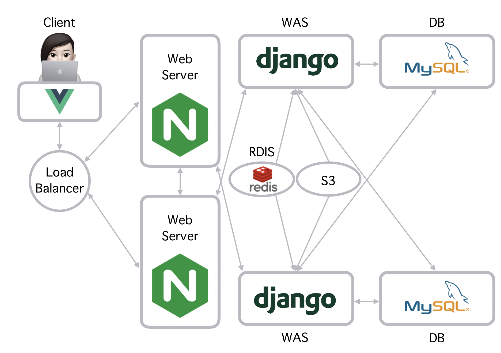
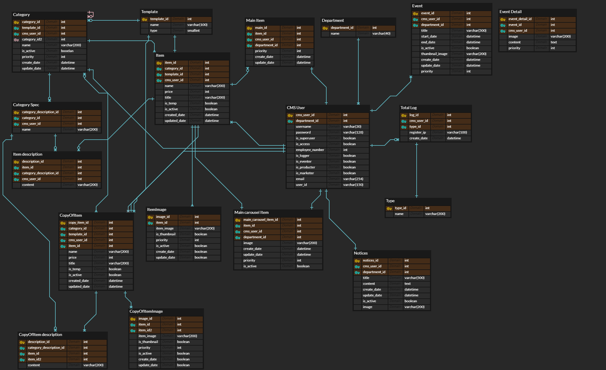

# Chameleon CMS - 제일기획 기업 연계 PJT

> 팀원 : 김유기(팀장), 강현영, 송은석, 임선빈, 장주환
>
> 개발기간 :  20.10.12 ~ 20.11.16
>
> 소개영상 :  https://youtu.be/PF1TWlqGhkM
>
> 시연영상 :  https://youtu.be/W2ff6Ov0sDw








## 목차

- [개요](#개요)
- [인프라](#인프라)
- [주요기능](#주요기능)
- [아키텍쳐](#아키텍쳐)
- [ERD](#ERD)
- [와이어프레임](#와이어프레임)
- [기술스택](#기술스택)
- [초기설정](#초기설정)
- [로컬서버실행](#로컬서버실행)
- [RESTAPI문서](#RESTAPI문서)


## 배포주소

Customer Page : https://chameleon.gq/

Admin Page : https://chameleon.gq/admin


## 개요

언택트 시대를 맞아 오프라인에서 확인하던 제품을 온라인으로 간편하게 확인하길 원하는 고객의 Needs를 반영

운영 효율성을 높이기 위해 제품의 추가/수정이 용이하도록 CMS로 제어할 수 있는 온라인 제품 소개 사이트 플랫폼 제작

운영되는 사이트의 트래픽을 감당하기 위해 HW 이중화 구조로 설계


## 인프라
- Classic load balancer 1
- Web Server 2
- Web Application Server 2
- Redis Server 1
- AWS S3 1
- Database server(mysql master-slave) 2


## 아키텍쳐


> 1. 클라이언트 요청 
> 2. 로드밸런서를 통해 자동으로 부하가 적은 웹서버로 할당
> 3. 정적파일 웹서버(Nginx)에서 제공 동적파일이 필요한경우 Nginx 내부 로드밸런서를 통해 자동으로 부하가 적은 WAS로 요청
> 4. WAS에서 DB 데이터를 받아와 가공후 전송
>    1. 요청받은 데이터가 기존의 정보와 동일하다면 DB 접근을 하지 않고 레디스에 캐싱된 데이터를 보내줌


## 주요기능

- 제품 등록 전 미리보기
- 부서 추가 기능
- 활동로그 기능
- 제품 카테고리별 레이아웃 템플릿 제공
- 제품별 레이아웃 템플릿 제공
- 이벤트 추가 / 수정 / 임시저장
- 이벤트 노출 활성화 / 비활성화
- 제품 등록 / 수정 / 임시저장 
  - 저장 히스토리 제공을 통해 git과 같이 과거에 등록했던 내용을 가져오기 가능
  - 제품 노출 활성화 / 비활성화
- 회원가입 / 로그인
- 공지사항 팝업 
- 유저 권한에 따른 페이지 접근 제한 및 업무 제한
- 제품 및 이벤트 검색 기능


## ERD




## 와이어프레임

[와이어프레임 보러가기](./doc/와이어프레임.pdf)


## 기술스택

- Frontend
  - Vue.js 2.6.11
  - Node.js 12.18.2
  - npm 6.14.5
- Backend
  - django 2.1.15
  - python 3.7.7
  - boto3 1.16.15
  - djangorestframework 3.11.1
  - gunicorn 20.0.4
  - django-storages 1.9.1
- Infra
  - aws ec2
  - rds
  - route 53
  - s3
  - redis
- OS
  
  - Ubuntu 18.04
- DB 
  
  - mysql 8.0.21
  
  

## 초기설정

### frontend

- node.js / vue-cli 설치
- frontend 라이브러리 설치

```
frontend /

npm install
```

### backend

- 필요한 라이브러리 설치

```
pip install -r requirements.txt
```

- backend env 파일 설정

> backend/cms_pjt 폴더로 이동후 .env 파일 생성
> 주의 : .env 파일 내부에서는 띄워쓰기를 하지 말아주세요!

```
SECRET_KEY=장고 시크릿키
DEBUG=디버그 여부

NAME=테스트 디비 이름
DB_USER=테스트 디비 유저
PASSWORD=테스트 디비 패스워드
HOST=테스트 디비 주소
PORT=테스트 디비 포트

MASTER_NAME=마스터 디비 이름
MASTER_USER=마스터 디비 유저 이름
MASTER_PASSWORD=마스터 디비 패스워드
MASTER_HOST=마스터 디비 주소
MASTER_PORT=마스터 디비 포트

SLAVE_NAME=슬레이브 디비 이름
SLAVE_USER=슬레이브 디비 유저 이름
SLAVE_PASSWORD=슬레이브 디비 유저 패스워드
SLAVE_HOST=cms-슬레이드 디비 주소
SLAVE_PORT=슬레이브 디비 포트

EMAIL_HOST_USER=확인메일 보낼 이메일 주소
EMAIL_HOST_PASSWORD=해당 아이디 비밀번호

AWS_REGION=s3 지역
AWS_STORAGE_BUCKET_NAME=s3 버킷 이름
AWS_ACCESS_KEY_ID=s3 접속 키 아이디
AWS_SECRET_ACCESS_KEY=접속시 연결 비밀키
AWS_DEFAULT_ACL=ACL 설정타입

LOCATION=redis 주소
REDIS_PASSWORD=redis 비밀번호
```

- mysql master-slave구조이기 때문에 변경없이 사용하기 위해서는 master-slave의 db를 연결해야 한다.
- db구조를 바꾸고 싶다면 settings.py에 db관련된 코드를 수정하면 된다.

- 정상적으로 연결이 되었다면 아래의 명령어 입력

```bash
python manage.py makemigrations
python manage.py migrate
```


## 로컬서버실행

- frontend

> frontend 폴더에서

```
npm run serve
```

- backend

> backend 폴더에서

```
python manage.py runserver
```


## RESTAPI문서

[RESTAPI 문서 보러가기](./doc/RESTAPI.md)